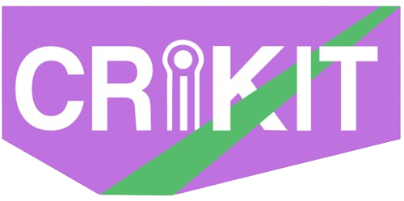

# Data analysis of Antibiotic Resistance Detection based on CRISPR-Cas13

<p align="center">
  
</p>

<p align="center">
  <em>A brief description of the project.</em>
</p>


## Table of Contents

- [Overview](#overview)
- [Getting Started](#getting-started)
  - [Prerequisites](#prerequisites)
  - [Installation](#installation)
  - [Usage](#usage)
- [Contact](#contact)
- [License](#license)

## Overview

Add your project description here. Explain what the diagnostic kit does, how it works, and its key benefits.

## Getting Started

### Prerequisites

Before you begin, ensure you have the following installed:

- **DT version** 0.33 or higher
- **ggplot2 version** 3.5.1 or higher
- **Shiny version** 1.10.0 or higher

### Installation

1. **Clone the repository**
   ```bash
   git clone https://gitlab.igem.org/2025/software-tools/groningen
   ```

2. ...

### Usage

Add usage instructions here. Include examples and screenshots.

## Contact

- [**Email**](mailto:igemteam@rug.nl)  
- [**Team Wiki**](https://2025.igem.wiki/groningen/)  
- [**LinkedIn**](https://www.linkedin.com/in/igem-groningen/)  
- [**Instagram**](https://www.instagram.com/igem_groningen/)

## License

This project is licensed under the GNU General Public License v3.0 - see the [LICENSE](LICENSE) file for details.
